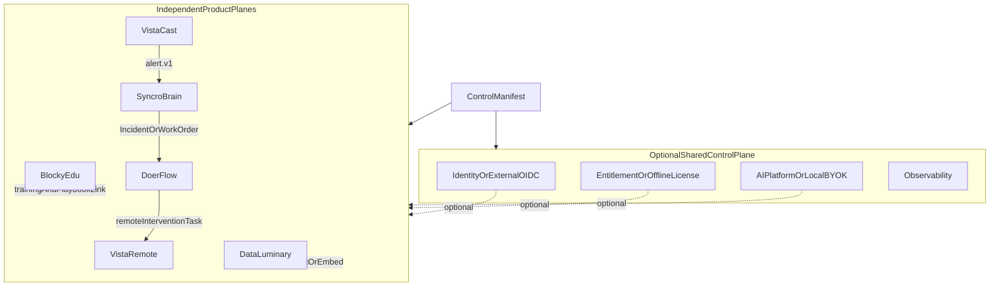

# LuminaryWorks 可组合部署规格 (v1.0)

> **状态**：Frozen（形态与契约冻结；实现分阶段） · **方法**：VibeCode Spec-Driven
> **实现**：[`@luminaryworks/control-manifest`](https://github.com/LuminaryWorks/shared/tree/master/packages/control-manifest) · [`deploy/`](../deploy/README.md)
> **相关**：[repository-relationships.md](./repository-relationships.md) · [ecosystem-refactoring.md](./ecosystem-refactoring.md) · [identity-and-permissions.md](./identity-and-permissions.md) · [subscription-and-entitlement.md](./subscription-and-entitlement.md) · [decisions/2026-09-storage-doris-payment.md](./decisions/2026-09-storage-doris-payment.md)

本文冻结 LuminaryWorks **联邦式产品套件**的部署形态与跨产品契约：六个产品继续各自拥有运行时、数据库、ACL 与发布节奏，同时通过**可选**共享控制面、版本化契约和场景编排实现组合部署。

## 0. 决策摘要（TL;DR）

| # | 决策 | 落地 |
|---|------|------|
| D-CD-1 | **联邦式，不是单体**：中央共享的是**契约**，不是强制运行时 | 本文 §2、§3 |
| D-CD-2 | 冻结五种部署形态：`standalone` / `control-plane` / `agent-commerce` / `smart-site` / `air-gapped` | §2 |
| D-CD-3 | 每个产品独占业务 DB、迁移、Casbin 策略、领域凭据与发布节奏 | §3 |
| D-CD-4 | 统一身份键 `(issuer, sub)`；org / tenant / resource **显式绑定**，映射留在负责该关系的产品适配器 | §4 |
| D-CD-5 | 跨产品事件统一 CloudEvents `id`/`source`/`type` + `traceparent` + source correlation | §5 |
| D-CD-6 | 静态 **Control Manifest** 描述 profile / 服务 URL / required / 契约版本 / 能力 / 降级；**不含 secret**、不含业务资源、不做动态服务注册 | §6 |
| D-CD-7 | 能力模式统一：`identity=central\|external_oidc\|local`、`entitlement=off\|shadow_read\|enforce\|offline_license`、`ai=off\|central\|local_byok`、`notification=none\|smtp` | §6.2 |
| D-CD-8 | **AuthN 永不降级为匿名**：`degradation.identity` 固定 `fail_closed` | §7 |
| D-CD-9 | 中央服务统一 `/health`（进程）、`/ready`（关键依赖非 2xx）、`/version`（API/schema/git） | §8 |
| D-CD-10 | 文档必须区分 `production` / `pilot` / `lab` / `stub`，`ai=central` 当前为 lab，**禁止**进入 pilot/production | §9 |
| D-CD-11 | **Compose 先行**：日常与组合交付以产品 Compose + `deploy/scenarios/*` 为准。Helm 保持门禁骨架，**不要求**安装 Helm CLI；K8s 为后续 | §10、§12 |

## 1. 为什么（Why）

1. **单品可售**：每个产品都必须能在兄弟产品全部关闭时启动并通过 ready，否则「独立商用」是空话。
2. **组合可卖**：`alert → Incident → 付费 Task → 远程介入 → 报表` 这条链才是生态溢价，但它不能以耦合数据库为代价。
3. **私有化可交付**：客户 IdP、离线 License、本地 BYOK、air-gapped 必须是一等公民，而不是事后补丁。
4. **诚实**：已编码 ≠ 已上线。部署形态必须显式携带成熟度，避免把 stub 当作生产能力售卖。

## 2. 五种部署形态（Profiles）



| profile | 含义 | 最小组成 | 允许的能力模式 |
|---------|------|----------|----------------|
| `standalone` | 单产品独立部署 / 单独销售 | 1 个产品 plane + 自有 DB | `identity` 任意；`entitlement` 建议 `off` / `offline_license`（`enforce` 会造成中央硬依赖，仅告警）；`ai=off\|local_byok` |
| `control-plane` | 只部署共享控制面 | Identity（+ Auth Gateway）+ Entitlement | 必须声明 `services.identity` |
| `agent-commerce` | 基础组合闭环 | VistaCast + SyncroBrain + DoerFlow（+ 可选控制面） | 三个产品 plane 必须声明 |
| `smart-site` | 上层完整闭环，**复用** `agent-commerce` | 前者 + VistaRemote + DataLuminary（+ BlockyEdu 培训入口） | BlockyEdu `required` 必须为 `false` |
| `air-gapped` | 断网 / 内网交付 | 单品或组合，无出网 | `ai≠central`；`entitlement∈{off, offline_license}`；`identity` 建议 `external_oidc`，允许 `local` |

**场景包只编排多个独立 Compose project**，不把六产品 Compose 文件合并成一个 project：合并会导致 service-name 撞名、卷共享和一次故障拖垮全栈。

`smart-site` 是 `agent-commerce` 的**叠加**，不是替代：控制面与业务数据库不重复部署。BlockyEdu 只提供与 site / incident / playbook 关联的课程与演练入口，**不是生产运行依赖**。

## 3. 产品自治边界（硬约束）

每个产品**独占**：

- 业务数据库与迁移（无共享 schema、无跨库外键、无跨产品直连）
- Casbin 策略与资源级授权（`permissions` 随资源下发；License 永不绕过 Casbin）
- 领域凭据：媒体 / 链上私钥 / RTSP / ThingsBoard token / TURN 凭据
- 发布节奏与版本号

**禁止**：

| 禁止项 | 理由 |
|--------|------|
| 跨产品 runtime import（`file:` 路径、直接引用对方源码） | 破坏独立发布 |
| 共享业务 schema / 共享业务数据库 | 破坏独立备份、迁移与合规边界 |
| 复用对方产品的 JWT 做资源授权 | audience 混淆 → 越权 |
| 把商业权益写入 JWT | 权益是可变事实，JWT 是缓存快照 |
| 原始视频帧 / 人脸模板 / RTSP 凭据 / 钱包私钥 / 学员 PII 出站 | 数据分类红线，见 §5.3 |
| 实时视觉 CV 走中央 LLM | 延迟与成本不成立，且把 lab 能力伪装成生产 |

**数据所有权**（争议时的唯一权威）：

| 事实 | 权威产品 |
|------|----------|
| 摄像头、视觉事件、告警状态与 ack | VistaCast |
| 设备、遥测、Incident / WorkOrder、Safety Kernel 与设备 RPC | SyncroBrain |
| 目录、Job、Receipt authorize/capture/void、账本与 Merkle | DoerFlow |
| 远程会话、房间、录制与审计 | VistaRemote |
| 报表、看板、导出与 embed | DataLuminary |
| 课程、演练、学员进度 | BlockyEdu |
| 身份（`issuer`/`sub`/org 准入） | Identity（或客户 IdP） |
| 套餐 / Trial / License / 配额 | 中央 Entitlement（或离线 License） |

DataLuminary **只消费** REST export / external-sync / embed，不成为设备 Safety Kernel、DoerFlow 结算或源告警状态的权威。DoerFlow 回调**不**自动 ack / resolve / close 源对象，也**不**执行设备 RPC。

## 4. 身份键与显式绑定

### 4.1 统一身份键

跨产品唯一稳定的用户标识是 **`(issuer, sub)`**：

```text
principal = (iss, sub)      # 例：("https://id.luminaryworks.dev/oidc", "usr_7f3c9a")
```

- `sub` **不可**跨 issuer 复用；换 IdP（`central` → `external_oidc`）等于换 principal，必须走显式迁移，不得靠 email 静默合并。
- email / 手机号 / 昵称**不是**身份键，只是可变属性。
- 每个产品在本地保存 `(issuer, sub) → 本地 userId` 映射，**由该产品自己拥有**；不建立共享用户表。

### 4.2 org / tenant / resource 显式绑定

```text
binding = (issuer, sub) × orgId? × productTenantId × resourceId
```

- `orgId` 来自 Identity 的组织准入（成员资格），**不携带**资源权限。
- `productTenantId` 由产品自己定义与持久化；中央不知道产品租户语义。
- 跨产品引用一律使用**显式绑定记录**，并保存在**负责该关系的产品**里：
  - VistaCast → SyncroBrain 的 site/device 关联：由发起关联的一侧持久化 `sourceTenantId` + `sourceObjectId`；
  - DoerFlow 的 `sourceTenantId` / offering 映射持久化在 DoerFlow，**不进中央权益表**。
- **禁止**用「同名 org」「同名 site」做隐式关联；缺映射时必须报错，不得猜测。

## 5. 跨产品事件与可靠性契约

### 5.1 CloudEvents 信封

| 字段 | 约束 |
|------|------|
| `id` | 生产方全局唯一；消费方以 `(source, id)` 做幂等键 |
| `source` | 产品 + 租户可解析的 URI，例：`https://vistacast.dev/t/{tenantId}` |
| `type` | 版本化，例：`vistacast.alert.v1`、`syncrobrain.incident.v1`；破坏性变更必须升版本，不得原地改语义 |
| `time` | RFC3339；配合重放窗口 |
| `subject` | 源对象 ID（用于 correlation） |
| `traceparent` | W3C Trace Context，跨产品透传 |
| `x-request-id` | 入口生成，全链透传 |

签名：HMAC（共享 secret 按对端隔离）或 OIDC `client_credentials`（audience 为被调方 API）。重放窗口 + nonce 必须存在。

### 5.2 写路径可靠性

- 所有跨产品写操作使用 **transactional outbox / inbox** + 幂等键；失败状态必须可观察（不得静默丢弃）。
- 首期**不引入 Kafka 作为硬依赖**；outbox + 轮询 + 租约（SKIP LOCKED）已足够。
- 消费方必须能重复收到同一事件而不产生重复副作用。

### 5.3 数据分类与出站拒绝

| 分类 | 出站规则 |
|------|----------|
| 原始视频帧 / 截图 / 人脸模板 | 禁止跨产品出站；仅传事件与证据引用 |
| RTSP / ONVIF / ThingsBoard 凭据 | 永不出站 |
| 钱包私钥 / 助记词 | 永不离开客户端 |
| 学员 PII、课程成绩 | 仅在 BlockyEdu 内；跨产品只传匿名化演练结果 |
| 遥测原始点位 | 默认聚合后出站 |

浏览器**不得**持有设备、MQTT 或管理凭据。

## 6. Control Manifest

### 6.1 定位

静态、可提交进 Git 的部署描述，由 [`@luminaryworks/control-manifest`](https://github.com/LuminaryWorks/shared/tree/master/packages/control-manifest) 解析与校验。

**只描述**：`profile`、`stage`、服务 URL、`required`、`apiVersion` / `schemaVersion`、能力模式、降级模式、参与场景的产品 plane。

**不包含**：任何 secret（secret-like key 与内联凭据一律拒绝）、业务资源、租户数据、动态服务注册。

```json
{
  "manifestVersion": 1,
  "profile": "control-plane",
  "stage": "dev",
  "capabilities": { "identity": "central", "entitlement": "shadow_read", "ai": "off", "notification": "none" },
  "services": {
    "identity":    { "url": "http://identity:3001/oidc", "required": true,  "apiVersion": "v1", "schemaVersion": "1" },
    "authGateway": { "url": "http://auth-gateway:3010",  "required": false, "apiVersion": "v1", "schemaVersion": "1" },
    "entitlement": { "url": "http://entitlement:3040",   "required": false, "apiVersion": "v1", "schemaVersion": "1" }
  },
  "degradation": { "identity": "fail_closed", "entitlement": "fail_closed" }
}
```

参考 manifest：[`deploy/manifests/`](../deploy/manifests)。

### 6.2 能力模式

| 能力 | 模式 | 含义 | 当前成熟度 |
|------|------|------|------------|
| `identity` | `central` | LuminaryWorks Identity（Logto） | production |
| | `external_oidc` | 客户 IdP（Entra / Okta / Keycloak） | production |
| | `local` | 产品本地目录（仍需本地用户 + Casbin） | **lab**：pilot/production 拒绝（`air-gapped` 仅告警） |
| `entitlement` | `off` | 不调用中央，沿用产品本地会员事实 | production |
| | `shadow_read` | 双读；本地决策生效，中央结果记差异 | production |
| | `enforce` | 中央结果生效（`services.entitlement.required` 必须为 `true`） | pilot |
| | `offline_license` | 离线签名 License（公钥验签；**不得**硬依赖中央服务） | pilot |
| `ai` | `off` | 关闭 AI 能力 | production |
| | `central` | 中央 AI Platform | **lab**：pilot/production 拒绝，见 §9.2 |
| | `local_byok` | 产品本地 BYOK | pilot |
| `notification` | `none` / `smtp` | SMTP 凭据来自 env / secret store，**不进 manifest** | production / pilot |

### 6.3 契约版本

`apiVersion`（HTTP 面）与 `schemaVersion`（DTO / 事件载荷主版本）都必须显式声明。消费方遇到**未知版本必须拒绝启动**，不得降级猜测。当前支持：全部中央服务 `apiVersion=v1`、`schemaVersion=1`。

### 6.4 环境覆盖

committed manifest 拥有**拓扑**；env 只重定向它**已声明**的条目（URL / required）与能力模式。为未声明的服务设置 URL 会被**忽略并告警**——拓扑必须在 Git 里可审计，不能从 env 里凭空出现。变量表见包 README。

## 7. 降级矩阵

| 能力 | 允许的降级 | 默认 | 约束 |
|------|-----------|------|------|
| `identity` | **仅** `fail_closed` | `fail_closed` | AuthN 永不降级为匿名；env 里试图改成别的值会被拒绝而不是忽略 |
| `entitlement` | `fail_closed` / `fail_open_local` / `offline_license` | `fail_closed`（`offline_license` 模式下为 `offline_license`） | `enforce` + `fail_open_local` 在 dev/lab 告警，在 pilot/production **报错**（等于停机期间免费送付费功能） |
| `ai` | `fail_closed` / `disable_feature` / `fallback_local_byok` | `disable_feature`（`local_byok` 模式下为 `fallback_local_byok`） | `ai=off` **不得**回退到 `local_byok` |
| `notification` | `fail_closed` / `queue` / `drop` | `queue` | `drop` 会静默丢失用户可见消息，仅告警场景使用 |

停机语义：任一**可选**中央服务停机时，系统严格按 manifest 声明降级；任一 **required** 服务停机时，`/ready` 返回非 2xx，plane 不接流量。Casbin 永不被绕过。

## 8. health / ready / version 契约

| 端点 | 语义 | 失败表现 |
|------|------|----------|
| `/health` | **只看进程**：进程活着即 200。不探测依赖，不做网络调用 | 进程死亡 → 连接失败 |
| `/ready` | 关键依赖不可用时返回**非 2xx**（503），并列出失败项 | 数据库 / 上游 IdP 不可用 → 503 |
| `/version` | `service`、`version`、`apiVersion`、`schemaVersion`、`gitSha` | — |

实现现状：

| 服务 | `/health` | `/ready` | `/version` |
|------|-----------|----------|------------|
| Identity（Logto 镜像） | 容器 healthcheck 探 OIDC discovery | [`identity/scripts/probe-readiness.mjs`](https://github.com/LuminaryWorks/identity)：discovery + 非空 JWKS，issuer 不匹配即失败 | Logto 不提供；版本在 manifest 中固定 |
| Auth Gateway | ✅ liveness only | ✅ 探上游 discovery（`AUTH_GATEWAY_READY_UPSTREAM=0` 可显式跳过） | ✅ |
| Entitlement | ✅ | ✅ 探数据库 | ✅ |
| AI Platform | ✅ `/v1/health`（liveness only） | ❌ 未实现 | ❌ 未实现 |

## 9. 诚实边界

### 9.1 四级标签

| 标签 | 含义 | 允许的表述 |
|------|------|-----------|
| `production` | 已上线、可售、有回归 | 「已上线」 |
| `pilot` | 有真实用户但范围受控 | 「试点中」 |
| `lab` | 本机 / 内网跑通，无生产硬化 | 「实验中」 |
| `stub` | 接口存在，实现是占位 | 「未实现」，**禁止**变现或计量 |

Control Manifest 的 `stage`（`dev`/`lab`/`pilot`/`production`）与能力成熟度联合校验：能力成熟度低于 stage 时，`lab`/`stub` 能力**报错**，`pilot` 能力**告警**。

### 9.2 当前不得宣称上线的能力

| 能力 | 真实状态 | 门禁 |
|------|----------|------|
| 中央 AI Platform（`ai=central`） | **lab**：无 AuthN、无 Entitlement 门禁、metering 仅进程内存、无 `/ready`、provider secret 无 vault 门禁 | preflight 拒绝 pilot/production；参考场景使用 `ai=off\|local_byok`。gate 清单见 `AI_CENTRAL_HARDENING_GATES`，**必须与落地同一次改动一起翻转** |
| VistaCast 视觉检测 / 人脸 / staff / fall-smoke | stub / 默认关 | 禁止标为生产变现能力 |
| DoerFlow 公开 commerce | 协议路径可用，公开 marketplace 变现未打生产 tag | 不得宣称已上线 |
| VistaRemote SFU | 未完成 | 不得宣称多方媒体已上线 |
| BlockyEdu 制造 / 实体 SKU | 试点 | 不得宣称量产 |
| SyncroBrain 全硬件兼容 | 部分型号 | 不得宣称通用兼容 |

## 10. Compose 契约

组合部署下的 Compose 必须满足（由 [`scripts/preflight-control-plane.mjs`](../scripts/preflight-control-plane.mjs) 与 [`scripts/lib/compose-contract.mjs`](../scripts/lib/compose-contract.mjs) 机械校验）：

| 规则 | 严重度 |
|------|--------|
| 不得固定 `container_name` | error |
| 不得出现 `host.docker.internal` / `gateway.docker.internal` | error |
| service 名不得是 `db`/`api`/`web`/`redis` 之类通用名（跨产品会撞名合并） | error |
| 同一 host port 不得被两个 service 发布 | error |
| 不得提交弱默认口令（`changeme`、`*_dev`、`dev-*-change-me` 等） | error |
| secret 解析为空 | dev 告警 / pilot·production error |
| 数据库 / Redis 发布 host port | dev 告警 / pilot·production error |
| 生产镜像使用浮动 tag（`latest`/`main`/`master`/`edge`）或无 tag | pilot·production error |
| 生产镜像未 digest 固定 | 告警 |
| 数据库挂在非 `internal` 网络 | pilot·production 告警 |
| manifest 指向的内部主机名在 stack 中不存在 | 告警 |

内部通信一律走 **Compose / K8s 网络 DNS 名**；生产数据库不暴露 host 端口；secret 前缀按产品隔离，不用一个共享 `.env` 承载全生态 secret。

现有 `identity/docker-compose.yml` 与 `services/entitlement/docker-compose.yml` **保持可独立运行**（各自 project 名、固定卷名、单机 dev 默认值）；[`deploy/compose/control-plane.yaml`](../deploy/compose/control-plane.yaml) 是**另一个** Compose project，复用同样的镜像但采用组合安全设置。二者不要同时占用同一批 host 端口。

## 11. 验收标准

分三层。**不要**把后面两层当成每次改动的日常门禁。

### 11.1 当前交付（Compose 实验室 / 日常）

日常只起 **一个** 产品栈。配置与契约：

- [x] Control Manifest schema / 解析 / env 覆盖 / 校验发布为 `@luminaryworks/control-manifest`（53 个用例）
- [x] 控制面 Compose + env example + preflight（manifest + compose 契约）就位
- [x] Auth Gateway 与 Entitlement 提供 `/health` `/ready` `/version`；Identity 提供 readiness 探针
- [x] `ai=central` 在 pilot/production 被 preflight 拒绝
- [x] `agent-commerce` / `smart-site` 场景包编排独立 Compose project（`deploy/scenarios/`）；产品 compose 缺失时 preflight 点名失败；不 merge、不重复部署控制面/业务 DB
- [x] 跨场景 contract fixture（JSON Schema / CloudEvents 样例）已提交于 `deploy/scenarios/contracts/`；**本仓不实现产品 sender**
- [x] 场景 Inbox URL / HMAC 示例与 `pnpm peers:init`（密钥 gitignored，按产品拷贝）；组合通信走 `luminary-control-edge` Docker DNS；本机演示可用 `deploy/scenarios/ingress/`（HTTP，不是 Let's Encrypt）
- [ ] 六产品分别在关闭兄弟产品后，按 documented standalone 模式启动并通过 `/ready`（按产品各自跑，不要求同一次 `compose up`）
- [ ] 各产品 standalone Compose 的 dev / prod / external-db / control-plane / smoke override

### 11.2 组合交付物（把场景当一次交付时）

把 `agent-commerce`（可选再加 `smart-site`）当作可演示组合时，跑一次真实编排即可，**不要**每次改动六产品全起：

```bash
pnpm peers:init -- --scenario agent-commerce
pnpm preflight:scenario -- --scenario agent-commerce
pnpm scenario:up -- agent-commerce --with-control-plane
```

- [ ] `agent-commerce` 在真实产品 Compose 上跑通 `/ready`（VistaCast / SyncroBrain / DoerFlow）
- [ ] 可选：`smart-site` 增量叠加 VistaRemote / DataLuminary（BlockyEdu `required: false`）
- [ ] 401/402/403、OIDC audience、Entitlement mode、Casbin、CloudEvents/HMAC、MQTT topic、WebRTC deep link、DoerFlow capture、DataLuminary embed 的跨仓合同测试

运行时仍取决于各产品仓自己的 Compose 文件与各自 gitignored env。`pnpm scenario:up -- --dry-run` 只打印独立 `docker compose` 命令。

### 11.3 后续私有化 / SaaS 硬化（非当前阻塞）

下列项属于生产组合门禁，**不是**当前 Compose 实验室的关门条件：

- [ ] 六产品同机同时 `up` 的全栈联调
- [ ] fresh install、dependency fault、restart persistence
- [ ] backup / `pg_dump` restore（每产品自己的库，禁止跨库备份）
- [ ] N-1 upgrade / rollback
- [ ] Helm 生产启用（见 §12）

## 12. Helm（后续；当前不要求）

**当前交付是 Compose。** 不要为了本文去安装 Helm CLI，也不要把 `deploy/helm/` 当成可上线的 chart。日常工作：产品 Compose + `deploy/scenarios/*`。K8s 是 Compose 组合跑通之后的映射，不是现在的路径。

骨架已放在 [`deploy/helm/`](../deploy/helm/)（含 `values.schema.json`），仅供以后对照：

1. 先跑通每个 standalone、以及作为交付物的 `agent-commerce` / `smart-site` Compose（§11.1–§11.2）。§11.3 的 backup / N-1 仍在 Compose 路径上，不阻塞现在的实验室。
2. 然后每产品一个**独立 chart**；LuminaryWorks umbrella chart 仅通过 `components.<product>.enabled` 选择依赖。
3. 共享 `global` 只含域名、registry、storageClass 与控制面 endpoint，**不含**共享数据库凭据。
4. Compose profile 映射为 Helm values；migration 用幂等 pre-upgrade Job；外部数据库、`existingSecret`、NetworkPolicy、PVC retention 均可配置。

`pnpm helm:template` 在未安装 Helm 时记录 skip 并退出 0。chart 先存在不等于已验收，**生产启用必须先通过 §11.2 的 Compose 组合交付**。

