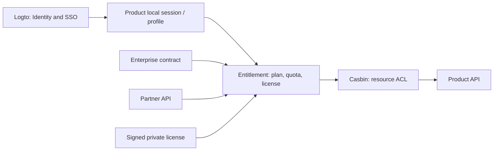

# LuminaryWorks 订阅与权益体系（Subscription & Entitlement）

> **状态**：Accepted · **决策日**：2024-04-28 · **冻结实现契约**  
> **关联**：[identity-and-permissions.md](./identity-and-permissions.md) · [migration-matrix.md](./migration-matrix.md) · [notification-service.md](./notification-service.md) · [ai-platform.md](./ai-platform.md) · [products/index.md](./products/index.md)  
> **草案来源**：`LuminaryWorks_Identity_Entitlement_Design.md`（设计输入）；`test.md` 中若干主张已被本规范**显式否决**（见 §0.2），不以 `test.md` 为权威。

## 0. 决策摘要（TL;DR）

| # | 决策 | 落地 |
|---|------|------|
| D-ENT-1 | **三层顺序固定**：Logto AuthN → 中央 Entitlement → 产品 Casbin 资源 AuthZ | 产品 Guard 串联；缺任一层不得放行付费能力 |
| D-ENT-2 | **商业权益不进 JWT / Logto `custom_data`** | Access Token 仅身份与产品准入；权益由 Entitlement API 查询 |
| D-ENT-3 | **统一身份 + 产品本地档案**：全局主键为 Logto `sub` | 各产品以 `externalUserId` / `logtoSub` 映射本地 profile、角色、资源 |
| D-ENT-4 | 权益主体：`USER` \| `ORGANIZATION` \| `DEPLOYMENT` | 个人订阅、企业合同 seat、私有化 License 分轨 |
| D-ENT-5 | Trial 由产品级 `trialPolicy` 控制：`standard_7d` 为**每用户每产品一次** 7 天，`disabled` 永不创建 | 企业合同、私有 License 与 DoerFlow **不创建** Trial |
| D-ENT-6 | 付费档：`trial` / `pro` / `ultra`；企业为合同套餐 + seat | Ultra ⊇ Pro；企业功能由合同 feature 集合定义 |
| D-ENT-7 | 私有化：**签名 License** 授予合同范围内 feature/quota；**绝不**用 Casbin「全局放行」绕过资源 ACL | License ≠ AuthZ bypass |
| D-ENT-8 | 联合会员 = Bundle/SKU 拆分为各产品独立 subscription/grant | Partner API 泛化，不硬编码合作方名称 |
| D-ENT-9 | 关键付费能力：Entitlement 不可确认时 **fail closed** | 短 TTL cache + 有限离线宽限（可配置） |
| D-ENT-10 | 迁移：`shadow_read` → 灰度 enforcement → 全量；可逆 feature flag | 旧字段保留至审计通过 |

核心原则：**身份统一，权益中央，资源权限产品私有；商业能力与 ACL 永不混装进 Token。**

### 0.1 权威边界

| 文档 | 角色 |
|------|------|
| **本文** | 订阅 / 套餐 / 配额 / License / Partner / HTTP 契约的**唯一权威** |
| [identity-and-permissions.md](./identity-and-permissions.md) | AuthN（Logto）与**资源** AuthZ（Casbin）；不定义商业套餐 |
| 各产品 `spec/` | 产品 feature code 清单与本地 Guard 接线；不得另立平行会员事实源 |

### 0.2 对既有草案的显式纠正（相对 `test.md` 等）

下列主张**禁止**进入实现（即便出现在内部备忘录中）：

| 错误主张 | 正确做法 |
|----------|----------|
| 私有化通过 Casbin「宽泛模型 / Guard 放行」绕过鉴权 | License 只注入 **Entitlement 结果**；Casbin 继续做资源 ACL |
| SaaS 企业 / 普通用户从 JWT `entitlements` claim 判定商业能力 | 产品调用 Entitlement Service；JWT **不得**携带业务权益 |
| 将资产标签写入 Logto `custom_data` 并签发进 Access Token | Logto 只管身份、组织归属、产品准入；权益库在中央服务 |
| Casbin matcher：`r.sub.entitlements.contains(p.sub)` | Casbin 只匹配资源策略；商业 feature 由 Entitlement Guard 判定 |
| 企业 Pro 权限写入 Organization `custom_data` | Organization 订阅 / seat 记在 Entitlement；Logto Org 仅身份与成员关系 |
| 业务代码大量 `if (isPrivate)` 分支改计费 | `DEPLOYMENT` 主体 + License 解析；部署模式不替代权益引擎 |

---

## 1. 三层检查顺序

```text
Request
  → 1. Logto AuthN（JWKS 验签，解析 sub / org / app_access）
  → 2. Entitlement（plan · feature · quota · seat · license）
  → 3. Casbin 资源 AuthZ（dashboard / course / device / …）
  → 业务逻辑
```



| HTTP / 语义 | 典型原因 |
|-------------|----------|
| `401` | 未登录 / Token 无效 |
| `402` 或稳定业务码 `ENTITLEMENT_*`（见 §9） | 身份有效但无商业权益 / 配额不足 / Trial 过期 |
| `403` | 有身份与（若需要）权益，但 **Casbin** 拒绝资源操作 |
| `429` | 配额限流（可选，与 `ENTITLEMENT_QUOTA_EXCEEDED` 并存时优先业务码） |

**禁止**：用 `403` 同时表示「没付钱」和「没资源权限」而不区分错误码。前端升级页只响应 entitlement 错误族；资源无权限走既有 ACL UX。

---

## 2. 账户模型

### 2.1 统一 Luminary Account

- 全局身份主键：**Logto `sub`**（字符串，稳定、不复用）。
- 用户注册一次，可访问已准入的多个产品（`app_access` / Application 授权）。
- **会员事实不按产品库分表主写**：中央 `subscriptions` / `grants` 为权威；产品本地仅缓存只读投影（可选）。

### 2.2 产品本地 Profile

每个产品保留自己的用户表 / 角色 / 资源图：

| 字段（示意） | 说明 |
|--------------|------|
| `id` | 产品本地主键 |
| `externalUserId` / `logtoSub` | 等于 Logto `sub`，唯一索引 |
| 角色、偏好、业务外键 | 产品私有 |

首次认证成功时 **upsert** 本地 profile（与 [identity-and-permissions.md](./identity-and-permissions.md) / product-auth skill 一致）。  
**不得**用本地 `role === 'vip'` 推断会员档；会员档只来自 Entitlement。

### 2.3 组织映射

- Logto **Organization** = 身份侧租户（SSO、成员、JIT）。
- 产品侧 Space / Team / Org（如 DataLuminary Space）保留本地 ACL 与业务数据。
- 显式映射：`logtoOrgId` ↔ 产品 `organizationId` / `spaceId`。
- **Seat 与企业订阅**挂在 Entitlement 的 `ORGANIZATION` 主体上；Space ACL **不**写入 Logto 或权益表。

---

## 3. 主体、产品与套餐

### 3.1 Subject kinds

| `subjectKind` | 标识 | 典型用途 |
|---------------|------|----------|
| `USER` | `logtoSub` | ToC Trial / Pro / Ultra / 个人 Partner redemption |
| `ORGANIZATION` | `logtoOrgId`（或已映射的稳定 org key） | 企业合同、seat 池 |
| `DEPLOYMENT` | `deploymentId`（私有化实例） | 签名 License |

解析上下文：`subject + productCode + optional org/deployment + asOfTime`。

### 3.2 首批产品 code（稳定）

| `productCode` | 产品 |
|---------------|------|
| `dataluminary` | DataLuminary |
| `blockyedu` | BlockyEdu |
| `vistaremote` | VistaRemote |
| `doerflow` | DoerFlow |

`products.trial_policy`（API 为 `trialPolicy`）只允许 `standard_7d | disabled`。DataLuminary、BlockyEdu、VistaRemote 固定为 `standard_7d`；DoerFlow 固定为 `disabled`。

### 3.3 Plan tiers

| `planCode` | 说明 |
|------------|------|
| `trial` | ToC 试用；固定 7 天；每用户每产品至多一次 |
| `pro` | 个人 / 小团队付费档 |
| `ultra` | 更高付费档；feature/quota **⊇ Pro**（并集超集） |
| `enterprise` | 合同套餐；可带 seat、自定义 feature 集合；**跳过 Trial** |

VistaRemote 现有本地模型为 `free` / `pro` / `enterprise`（见 `vistaremote/shared/src/billing`）。迁移时：

- 本地 `free` + 有效 `trialEndsAt` → 中央 `trial` 或「无付费 + Trial grant」；
- 本地 `pro` → `pro`；
- 本地 `enterprise` → `enterprise`（合同或历史 perpetual 映射）；
- 中央新增 `ultra` 为跨产品统一更高档；VistaRemote Ultra feature 集合在迁移表中显式列出（默认可对齐现 Enterprise 能力子集 + 扩展项，以种子目录为准）。

### 3.4 Feature 与配额

- **Feature**：布尔或枚举能力，稳定 `featureCode`（建议 `domain.action`，如 `webrtc.sfu`、`dashboard.export`）。
- **Quota**：数值额度 + 周期（`lifetime` | `calendar_month` | `rolling_days` | `concurrent`）。
- Plan 通过 `plan_features` 绑定：`effect = allow | deny`，`limitValue` 可空（布尔 feature 为空）。

**种子 feature 基线（迁移期，可扩展，不可静默改语义）**：

| 产品 | 示例 `featureCode`（非穷尽） | 来源 |
|------|------------------------------|------|
| VistaRemote | `webrtc.sfu`, `recording`, `ai.recording_summarize`, `ai.cloud_infer`, `recording.sfu_server`, `telemetry.enterprise` | 现有 `ProductFeature` |
| BlockyEdu | `code.execute.pro`, `ai.copilot`, `ai.tutor`, 班级/学员额度类 quota | `code_pro` / memberTier 迁移 |
| DataLuminary | `dashboard.export`, `ai.analysis`, `storage.bytes`, `dashboard.count` 等 | 商业能力与容量门禁 |
| DoerFlow | `agent.publish`, `skill.register`, `task.publish`, `ai.strategy.run`, `settlement.merkle_batch`, `admin.ops.read`；`agent.limit`, `task.publish.monthly`, `api.request.monthly` 配额 | Agent 区块链平台能力；链上手续费、Escrow、技能按次计价不进入 Entitlement |

---

## 4. Trial（ToC）

产品策略：

| `trialPolicy` | 合同 |
|---------------|------|
| `standard_7d` | 按下表执行一次性 7 天 Trial |
| `disabled` | `POST /v1/trials/ensure` 返回 `PRODUCT_TRIAL_DISABLED`；不得创建 redemption、subscription、grant 或 Trial outbox 事件；订单、Partner redemption、Admin/manual grant 均不得为该产品发放 `trial` |

DoerFlow 为无试用、付费优先产品，固定 `disabled`，目录只含 Pro / Ultra / Enterprise。客户端必须依据目录 `trialPolicy` 或快照 `trial.eligible=false` 隐藏 Trial CTA 与倒计时。

| 规则 | 值 |
|------|-----|
| 时长 | **7×24 小时**（从 `startsAt` 起算；服务端时钟权威） |
| 发放时机 | 用户**首次进入**某产品受控面（首次需鉴权的业务会话或显式 `POST /trials/ensure`） |
| 唯一性 | **once per (`logtoSub`, `productCode`)**；用 `trial_redemptions` 或等价唯一约束防重放 |
| 企业 / 私有 | `ORGANIZATION` 有效企业订阅或 `DEPLOYMENT` 有效 License 存在时：**不创建** Trial |
| 到期后 | 仍可登录、看账户/账单、走升级；受控业务 API 返回 §9 错误 |
| Trial 能力 | 默认授予该产品 **Pro 等价 feature 集**（产品可在目录中收窄，须文档化） |

幂等：`standard_7d` 产品的 `ensureTrial` 多次调用返回同一 subscription/grant，不延长期限。现有三个产品的一次性规则不因 DoerFlow 接入而改变。

---

## 5. 企业合同与 Seat

- 合同创建 `ORGANIZATION` 订阅：`planCode=enterprise`（或合同定制 plan），`source=contract`。
- **Seat**：`organization_seats`（`orgId`, `productCode`, `seatLimit`, `seatUsed`）；成员占用在加入产品企业上下文时校验。
- 用户在企业上下文访问：有效权益 = 个人 `USER` 权益 ∪ 当前 org 的 `ORGANIZATION` 权益（见 §7）。
- 有有效企业订阅的 org 成员：**不触发**该产品 ToC Trial 发放。
- Seat 超限：`ENTITLEMENT_SEAT_EXHAUSTED`；不静默挤占。

---

## 6. 私有化 License

### 6.1 原则

- 私有化属于 **物理部署隔离**，不是「关闭权限系统」。
- License 经验证后映射为 `DEPLOYMENT` 主体上的 grant（或本地等价缓存），**仅**开放合同声明的 products / features / limits。
- **禁止**：Casbin 加载「全局 allow」；**禁止**跳过 JWT/OIDC（除非产品显式 `IDP_MODE` 小型离线模式，且仍须本地用户 + Casbin，见 identity 规范私有化 C，不推荐）。

### 6.2 载荷（Ed25519 签名）

```json
{
  "licenseId": "lic_…",
  "kid": "2024-04-key",
  "deploymentId": "dep_…",
  "products": ["dataluminary", "blockyedu"],
  "features": {
    "dataluminary": { "dashboard.export": true, "dashboard.count": 200 },
    "blockyedu": { "code.execute.pro": true, "student.limit": 500 }
  },
  "seats": { "dataluminary": 100 },
  "issuedAt": "2024-04-01T00:00:00.000Z",
  "expiresAt": "2025-04-01T00:00:00.000Z",
  "offlineGraceDays": 14,
  "customerName": "Example Corp"
}
```

- 签名：对 canonical JSON（或分离的 payload bytes）做 **Ed25519**；产品内置公钥集按 `kid` 选择。
- 校验失败 / 过期且超出 grace：**fail closed**（除登录与 License 更新入口）。
- Grace：仅允许在已成功校验过的缓存基础上短暂离线；首次安装无缓存不得宽限。

---

## 7. 权益解析语义

输入：`{ subjectKind, subjectId, productCode, organizationId?, deploymentId?, asOf }`。

1. 收集所有 **active** 来源：未撤销、`startsAt ≤ asOf < endsAt`（`endsAt` 空视为长期）、License 在有效期或 grace。
2. 来源可包括：Trial grant、个人 Pro/Ultra subscription、Bundle 拆分 grant、Partner redemption、Org 企业订阅、Deployment License。
3. **布尔 feature**：任一来源 `allow` 且无显式 `deny` 覆盖 → `true`。（同 feature 上 `deny` 优先于 `allow`。）
4. **Quota**：默认 **取各来源 limit 的最大值**（`max`）；目录可对特定 feature 声明 `quotaMerge=sum`（须种子标注）。`remaining = limit - usage`（usage 来自 `usage_counters`）。
5. **Effective plan label**（展示用）：按优先级 `enterprise > ultra > pro > trial > none`；不影响 feature 并集计算。
6. 过期 / 撤销：**立即**从解析中消失；cache TTL 必须短于或等于配置上限（默认 ≤ 60s）。
7. 写入一律带 `source`、`sourceRef`、审计日志；人工发放走管理 API + audit。

### 7.1 配额消费

- `POST /v1/entitlements/consume`：**原子**增减；并发下用行锁 / 条件更新。
- 幂等键：`Idempotency-Key` 或 body `idempotencyKey`；同一键重复返回首次结果。
- 不足：不部分扣减；返回 `ENTITLEMENT_QUOTA_EXCEEDED`。

---

## 8. Bundle、联合会员与 Partner

### 8.1 Bundle（生态内联合）

- `bundles` + `bundle_items`：一个 SKU 对应多 `(productCode, planCode)`。
- 购买成功 → **拆分**为各产品独立 `subscriptions` / `grants`（同源 `orderId` / `bundleId`）。
- 撤销 / 退款：按政策级联撤销同源 grant；部分产品保留须显式配置。

### 8.2 Partner protocol（跨企业）

不硬编码「京东 / 喜马拉雅」等名称；一律 Partner 记录：

| 能力 | 要求 |
|------|------|
| 认证 | OAuth2 **client_credentials**（Partner M2M） |
| 兑换 | `POST /v1/partner/redemptions`：幂等 `redemptionId`；绑定 `logtoSub` 或兑换码 |
| Webhook | 签名（HMAC-SHA256 或非对称）+ `timestamp` + nonce；拒绝重放窗口外请求 |
| 撤销 | `POST /v1/partner/redemptions/{id}/revoke` |
| 对账 | 分页列出时间窗内 redemption 状态 |

成功兑换 → 生成带 `source=partner` 的有期限 grant（映射到声明的 product/plan/features）。

---

## 9. HTTP 与错误语义（冻结）

Base path（SaaS）：`/v1`。管理端与 Partner 端使用独立 audience / scope；**不信任**浏览器传入的 `subjectId`（以 Token `sub` / M2M 声明为准）。

### 9.1 核心 API

| Method | Path | 说明 |
|--------|------|------|
| `GET` | `/v1/entitlements` | 当前主体在 `productCode`（+ org）下的有效权益快照 |
| `POST` | `/v1/entitlements/check` | 批量 `{ featureCode, need? }[]` → allow/deny + reason |
| `POST` | `/v1/entitlements/consume` | 原子配额消费 |
| `POST` | `/v1/trials/ensure` | 幂等发放 ToC Trial |
| `GET` | `/v1/catalog/plans` | 产品套餐目录；每个产品返回 `trialPolicy` |
| `GET` | `/v1/catalog/features` | feature 定义 |
| `POST` | `/v1/orders` | 创建订单（支付适配器抽象） |
| `POST` | `/v1/orders/{id}/pay` | 支付回执 / 适配器回调入口（服务端） |
| `POST` | `/v1/admin/grants` | 人工合同发放（admin scope） |
| `POST` | `/v1/partner/redemptions` | Partner 兑换 |
| `GET` | `/health` | 存活 |
| `GET` | `/ready` | 依赖就绪（DB） |

### 9.2 权益快照 DTO（示意）

```json
{
  "productCode": "vistaremote",
  "subjectKind": "USER",
  "subjectId": "user_…",
  "organizationId": null,
  "effectivePlan": "pro",
  "trial": { "active": false, "endsAt": null, "consumed": true, "eligible": false },
  "features": {
    "webrtc.sfu": { "allowed": true, "sources": ["subscription:sub_…"] },
    "ai.cloud_infer": { "allowed": false, "reason": "ENTITLEMENT_FEATURE_REQUIRED" }
  },
  "quotas": {
    "device.limit": { "limit": 10, "used": 3, "remaining": 7, "period": "lifetime" }
  },
  "asOf": "2024-04-28T15:00:00.000Z"
}
```

### 9.3 稳定错误码

响应体：

```json
{
  "error": {
    "code": "ENTITLEMENT_TRIAL_EXPIRED",
    "message": "Trial expired; upgrade required",
    "productCode": "dataluminary",
    "featureCode": "dashboard.export",
    "httpStatus": 402
  }
}
```

| `code` | HTTP | 含义 |
|--------|------|------|
| `ENTITLEMENT_REQUIRED` | 402 | 需要有效订阅 |
| `ENTITLEMENT_TRIAL_EXPIRED` | 402 | Trial 已过期 |
| `ENTITLEMENT_FEATURE_REQUIRED` | 402 | 当前 plan 不含该 feature |
| `ENTITLEMENT_QUOTA_EXCEEDED` | 402 | 额度不足 |
| `ENTITLEMENT_SEAT_EXHAUSTED` | 402 | 企业 seat 用尽 |
| `ENTITLEMENT_LICENSE_INVALID` | 402 | License 无效 / 篡改 |
| `ENTITLEMENT_LICENSE_EXPIRED` | 402 | License 过期（含超出 grace） |
| `ENTITLEMENT_SERVICE_UNAVAILABLE` | 503 | 中央服务不可达且无合法离线缓存（关键路径 fail closed） |
| `PRODUCT_TRIAL_DISABLED` | 402 | 产品策略禁止 Trial；调用方不得重试创建或改走其他发放入口 |
| `UNAUTHORIZED` | 401 | 身份无效 |
| `FORBIDDEN` | 403 | **仅**资源 ACL（Casbin）；产品层使用，非 Entitlement 服务主码 |

产品可在本地兼容层将历史 reason（如 VistaRemote `TRIAL_EXPIRED_REQUIRES_PRO`）**映射**到上表，对外逐步统一。

---

## 10. 通知（Trial T-3 与到期）

依赖 [notification-service.md](./notification-service.md) 与 `@luminaryworks/notification`；Entitlement 服务侧用 **transactional outbox** 投递，避免双写丢失。

| 事件 | 时机 | 渠道（适配器） |
|------|------|----------------|
| `trial.expiring` | 到期前 **3 天**（T-3） | 站内信、Email、APP Push（按用户偏好） |
| `trial.expired` | `endsAt` 到达后 | 同上 |

规则：

- 同一 `(user, product, eventType, scheduledFor)` **至多成功发送一次**；失败可重试，成功去重。
- 已升级为付费 / 已有企业权益：取消待发 Trial 通知。
- 文案与品牌由产品模板提供；共享包只做传输。

---

## 11. 数据模型（实现冻结形状）

PostgreSQL。表名稳定；列可增不可静默改语义。

| 表 | 用途 |
|----|------|
| `products` | `code` 唯一；`trial_policy = standard_7d | disabled` |
| `features` | `product_id` + `code`；类型 bool/quota |
| `plans` | `product_id` + `code`（trial/pro/ultra/enterprise/…） |
| `plan_features` | plan↔feature；limit / effect / quota_merge |
| `bundles` / `bundle_items` | 联合 SKU |
| `subscriptions` | subject、plan、状态、起止、source |
| `grants` | 细粒度或覆盖型授权（partner/manual/license 投影） |
| `organization_seats` | seat 限额与占用 |
| `usage_counters` | 配额用量 |
| `trial_redemptions` | `(logto_sub, product_code)` 唯一 |
| `partners` / `partner_benefits` | 合作方与权益模板 |
| `redemptions` | 兑换记录与幂等键 |
| `licenses` | 已签发 / 已激活 License 元数据 |
| `orders` / `webhook_events` | 订单与支付回调 |
| `outbox_events` | 通知与对外事件 |
| `audit_logs` | 写入审计链 |

`subscriptions.status`：`active` | `canceled` | `expired` | `pending`。  
所有写路径记录 `actor`、`reason`、`requestId`。

---

## 12. 共享客户端与产品接线

目标包：`shared/packages/entitlement-client`（`@luminaryworks/entitlement-client`）。

能力：NestJS module、短 TTL cache、批量 check、quota consume、License 本地校验 fallback、统一错误 DTO。

产品 Guard 顺序（示意）：

```text
LuminaryJwtAuthGuard → EntitlementGuard(feature) → PermissionGuard(Casbin)
```

| 产品 | 适配要点（现状 → 目标） |
|------|-------------------------|
| **DataLuminary** | DataTalk：`JwtAuthGuard` + `PermissionGuard` 之间插入 Entitlement；Casbin 继续管 dashboard/space/dataset；高级分析/导出/容量走 feature/quota。DataView：Trial 倒计时、Pro/Ultra 升级、企业视图。Space ↔ Logto Org 显式映射 + seat。 |
| **BlockyEdu** | `edu-server` / `server` 接入 client；`memberTier` / `code_pro` 等改为 feature code；课程班级作业 ACL 仍 Casbin。双前端 Trial/升级 UX；OIDC 未稳时保留 legacy 登录开关。 |
| **VistaRemote** | 以 `shared/src/billing` catalog 为迁移基线；`server` billing 改为中央适配器，保持 `GET /billing/entitlements` 等 DTO 兼容；SFU/AI/录制门禁走 entitlement；设备会话归属仍 Casbin/ABAC。 |

---

## 13. 迁移、Shadow-read 与 Flag

| Flag / 模式 | 行为 |
|-------------|------|
| `ENTITLEMENT_MODE=off` | 不调用中央；沿用产品本地会员事实（回滚） |
| `ENTITLEMENT_MODE=shadow_read` | 双读：本地决策仍生效；中央结果记差异日志 |
| `ENTITLEMENT_MODE=enforce` | 中央结果生效；本地只读兼容字段 |
| 灰度 | 按 `productCode` + 用户百分比 / org allowlist |

顺序建议：DataLuminary → BlockyEdu → VistaRemote。  
旧列（如 `User.plan`、`trialEndsAt`）在审计通过前 **不删除**。迁移脚本须可重复执行、可对账。

---

## 14. 安全与非目标

**必须**：

- 管理 / Partner 端点独立 scope；校验 deployment / partner 身份。
- 关键路径在权益不确定时 fail closed。
- License 防篡改、过期、kid 轮换；Partner 防重放。
- 不在浏览器存储长期 Partner 密钥。

**非目标**：

- 不在 Logto / JWT 中存放商业 entitlements。
- 不用 Entitlement 表存储产品资源 ACL。
- 不强制六产品同一套本地角色表。
- 不在本服务内实现完整支付渠道（仅订单抽象与适配器接口）。

---

## 15. 实现冻结检查清单

在编写 `services/entitlement` 与产品适配前，下列项视为已冻结（变更需改本文件并 bump 决策日）：

1. 三层顺序与「权益不进 JWT」  
2. Subject 三种类与 Trial 唯一性规则  
3. Plan 档位命名：`trial` / `pro` / `ultra` / `enterprise`  
4. 错误码表与 `402` vs `403` 分工  
5. License 不绕过 Casbin  
6. Bundle 拆分与 Partner 幂等兑换形状  
7. T-3 / 到期通知事件名与去重键  
8. `ENTITLEMENT_MODE` 三态迁移  

OpenAPI 以本契约为准生成；种子目录可增 feature，不得改变已发布 code 语义。
`)